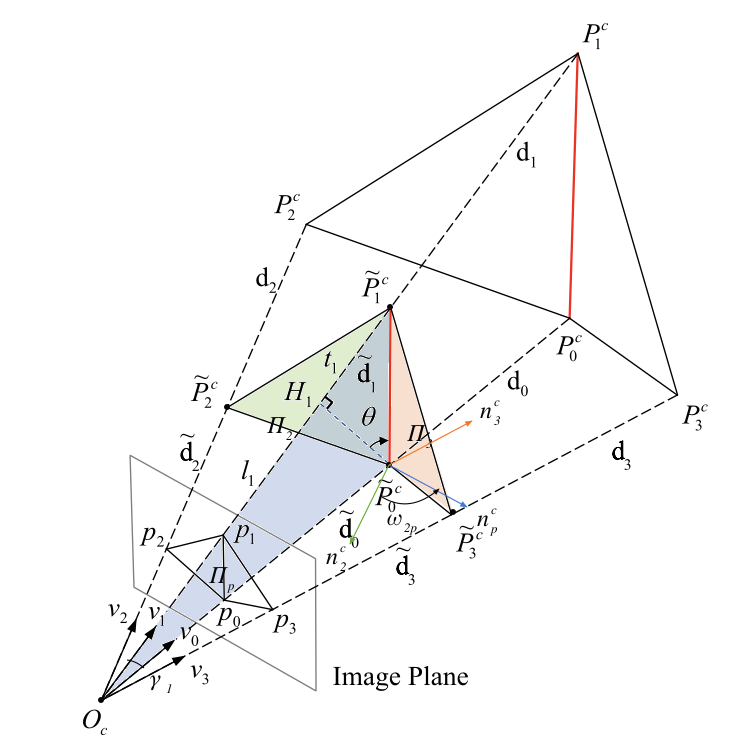
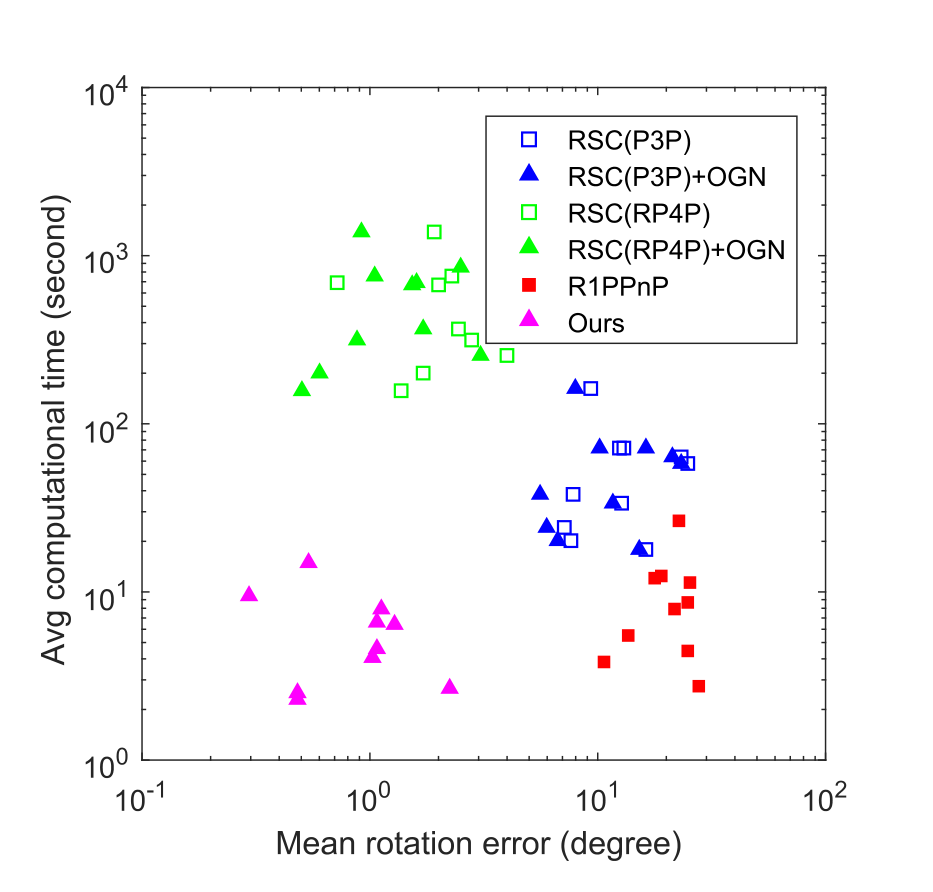
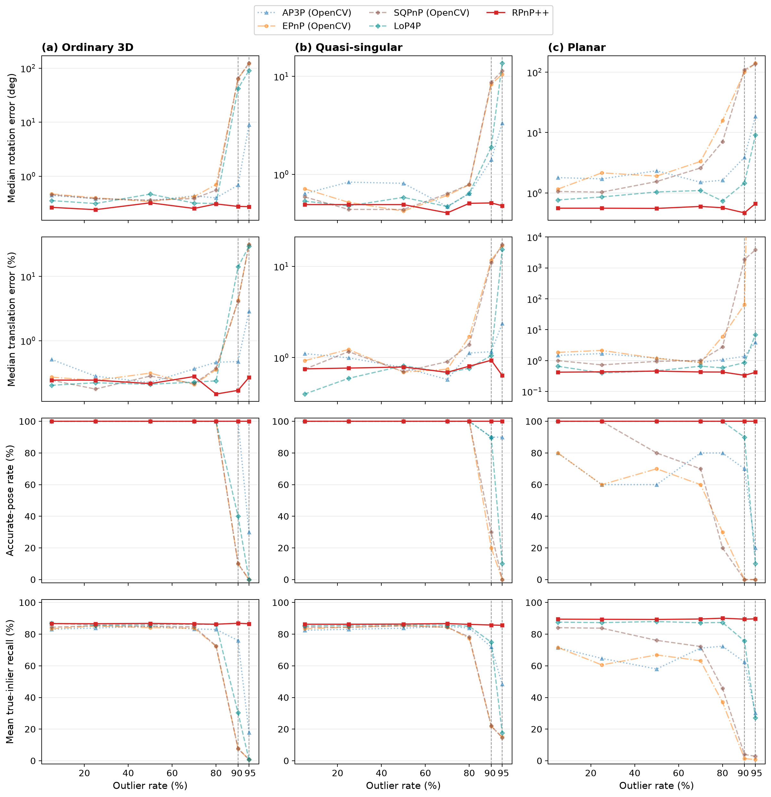
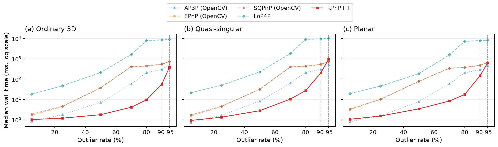

# RPnP++: A Hough Voting-Based 2-Point RANSAC Solution to the Perspective-n-Point Problem

[](https://doi.org/10.1109/TIP.2025.3622336) [](https://pypi.org/p/rpnp-pp) [](https://github.com/xuchi7/RPnP_plusplus)

The C++ and Python implementation of the paper
[A Hough Voting-Based 2-Point RANSAC Solution to the Perspective-n-Point Problem](https://doi.org/10.1109/TIP.2025.3622336).

Chi Xu, Tingrui Guo, Yuan Huang, Li Cheng

## Abstract

> Perspective-n-point is a fundamental problem in multi-view geometry, yet two critical challenges persist: 1) The issues of high outlier rate and near degenerate cases exert a substantial impact on the robustness of existing PnP methods. In the worst-case where both issues are in presence, existing methods tend to either produce erroneous results or become computationally prohibitive. 2) Conventionally, the hypothetical pose with the maximum inlier-set is assumed to be correct. However, it remains unclear whether this assumption holds when the outlier rate approaches ultra-high levels, and along this line what is the maximum amount of outliers that can be robustly handled. To address these challenges, this paper proposes a novel Hough voting based 2-point RANSAC solution. To our knowledge, it is the first PnP solution capable of accurately and efficiently handling high outlier rates in near-degenerate cases. Extensive empirical evaluations have been conducted using the proposed approach, with a particular focus on a systematic examination under ultra-high outlier rates. The results show that, on random synthetic data, our approach works robustly even when dealing with up to 99% outliers. Meanwhile on real-world datasets, the maximum inlier-set assumption oftentimes fails when the outlier rate exceeds 97%, as the incorrect hypothetical poses may yield more inliers than the ground-truths.

<p align="center">
  &emsp;&emsp;
  
</p>

## Highlights

- A novel Hough voting based 2-point RANSAC solution is proposed.
- It is the first PnP solution capable of accurately and efficiently handling
  high outlier rates in near-degenerate cases.
- Compared with the state-of-the-art LoP4P, it achieves higher accuracy while
  being up to 800× faster.

## Installation

### Python

Install the published package with pip:

```bash
python -m pip install rpnp_pp
```

To build the Python wheel from this repository:

```bash
python -m pip install --upgrade build
python -m build --wheel
python -m pip install --force-reinstall dist/rpnp_pp-*.whl
```

The project is branded RPnP++, and `rpnp_pp` is the Python distribution/import
name.

### C++

The bundled Eigen headers make a system Eigen installation unnecessary for the
default build.

```bash
cmake -S . -B build \
  -DBUILD_PYTHON=OFF \
  -DBUILD_TESTS=ON \
  -DBUILD_EXAMPLES=ON \
  -DINSTALL_CPP_SDK=ON \
  -DCMAKE_BUILD_TYPE=Release
cmake --build build --parallel
cmake -E chdir build ctest --output-on-failure
cmake --install build --prefix "$HOME/.local"
```

For a CMake consumer, use the installed package as follows:

```cmake
find_package(r2ppnp 0.1 CONFIG REQUIRED)
target_link_libraries(your_target PRIVATE r2ppnp::r2ppnp)
```

The C++ target and namespace retain their existing `r2ppnp` identifiers as
source/API compatibility names; the algorithm name shown to users is RPnP++.

## Python example

```python
import numpy as np
import rpnp_pp

world_points = np.asarray(...)  # shape (3, N) or (N, 3)
pixel_points = np.asarray(...)  # shape (2, N) or (N, 2)
K = np.asarray(...)             # shape (3, 3)

result = rpnp_pp.solve(
    world_points,
    pixel_points,
    K,
    th_pixel=10.0,
    config=rpnp_pp.Config(seed=3, finalize=True),
)
if result.success:
    print(result.R, result.t, result.num_inliers)
    rvec = result.rvec  # OpenCV-compatible Rodrigues vector, shape (3, 1)
    tvec = result.tvec  # OpenCV-compatible translation column, shape (3, 1)
```

Inputs must be finite, calibrated, and undistorted. At least six
correspondences are required. See `python/rpnp_pp/__init__.py` for the full
API contract and result fields.

## Synthetic benchmark

The reproducible benchmark protocol, scripts, raw CSV data, metadata, and
checked-in figures are all in [`benchmark/`](benchmark/). The figures use the
approved layout and show:

- AP3P (OpenCV): OpenCV RANSAC + AP3P
- EPnP (OpenCV): OpenCV RANSAC + EPnP
- SQPnP (OpenCV): OpenCV RANSAC + SQPnP followed by ITERATIVE refinement
- LoP4P
- RPnP++

P3P data remain in the raw six-method run record for provenance, but P3P is
omitted from the checked-in plots. The plots use outlier rates through 95%;
the stored metadata also records the optional 97% extension.





To reproduce the plotted benchmark in a fresh output directory:

```bash
python -m pip install --upgrade build
python -m build --wheel
python -m pip install --force-reinstall dist/rpnp_pp-*.whl
python -m pip install numpy opencv-python-headless matplotlib
python benchmark/run_comparison.py \
  --output-dir /tmp/rpnp-plus-plus-benchmark
python benchmark/plot_comparison.py /tmp/rpnp-plus-plus-benchmark
```

The default runner uses the checked-in protocol parameters. For the exact
parameters and implementation labels, see
[`benchmark/metadata.json`](benchmark/metadata.json). The generated directory
is intentionally separate from the checked-in result files.

## Real-world experiments

To reproduce the real-world experiments reported in the paper, see the
implementation in the original [xuchi project](https://github.com/xuchi7/RPnP_plusplus).

## Citation

If RPnP++ is useful to your work, we would appreciate it if you cite:

```bibtex
@article{xu2025rpnp,
  title   = {A Hough Voting-Based 2-Point RANSAC Solution to the Perspective-n-Point Problem},
  author  = {Xu, Chi and Guo, Tingrui and Huang, Yuan and Cheng, Li},
  journal = {IEEE Transactions on Image Processing},
  volume  = {34},
  pages   = {6838--6851},
  year    = {2025},
  doi     = {10.1109/TIP.2025.3622336}
}
```
